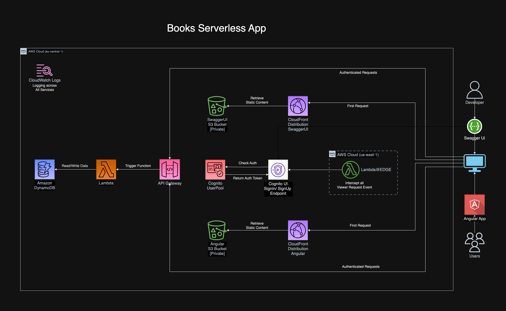

# Books Serverless App

Books Serverless App is a serverless application built with AWS services. It leverages services such as S3, CloudFront, Lambda@Edge, Cognito, SSM Parameter Store, API Gateway, Lambda, and DynamoDB to provide a comprehensive serverless solution.
The infrastructure is managed as code using AWS CDK.

This project is organized as a monorepo, with the frontend, backend, and infrastructure each located in their own directories.

## Architecture



## Components

### Infrastructure

The Infrastructure for the application is managed as code using AWS CDK. This allows for easy deployment and management of the AWS resources used in the application.

The Infrastructure code can be found in the `packages/books-app-infra` directory.

### Frontend

The Frontend is an Angular application hosted in an S3 bucket. Content is distributed via CloudFront. User authentication is managed by a Cognito user pool.

The Frontend code can be found in the `packages/books-app-frontend` directory.

### Backend

The Backend is composed of an API Gateway that routes requests to a Lambda function. This function handles the CRUD operations for the book application.

The Backend code can be found in the `packages/books-app-backend` directory.

### Swagger Documentation

The CRUD operations of the backend Lambda function are documented in Swagger. The Swagger files are hosted in another S3 bucket, which is also fronted with CloudFront. User authentication is managed by Cognito hostedUi and a Lambda@Edge function which intercepts the Cloudfront Viewer Request. The Cognito IDs required by the Lambda@Edge function are stored in the SSM Parameter Store .

### Database

The data for the application is stored in a DynamoDB table.

## Getting Started

These instructions will get you a copy of the project up and running on your local machine for development and testing purposes.

### Prerequisites

- You need to have Node.js and npm installed on your machine. You can download Node.js [here](https://nodejs.org/en/download/) and npm is included in the installation.
- Install Angular CLI globally: `npm install -g @angular/cli`
- Install AWS CDK globally: `npm install -g aws-cdk`
- AWS CLI configured with your credentials. You can follow [this guide](https://docs.aws.amazon.com/cli/latest/userguide/cli-configure-files.html) to set it up.

### Installing

1. Clone the repository:
   ```
   git clone https://github.com/GowsikChandran/Books-AWS-ServerlessApp-CDK.git
   ```
2. Navigate to the root directory of the project and install the dependencies:

   ```
   cd BooksServerlessApp
   npm install
   ```

### Building the Application

1. To build the frontend Angular application, navigate to the frontend directory and run:

   ```
   cd packages/books-app-frontend
   ng build
   ```

2. To build the backend Lambda function, navigate to the backend directory and run:

   ```
   cd packages/books-app-backend
   npx projen
   npx projen bundle-backend-lambda
   npx projen zip-backend-lambda
   ```

### Deployment

To deploy the infrastructure, navigate to the infrastructure directory and run:

```
  cd packages/books-app-infra
  npx projen
  npx projen deploy
```

### Destroying the Application

To destroy the infrastructure and clean up the resources, navigate to the infrastructure directory and run:

```
 npx projen destroy

```
